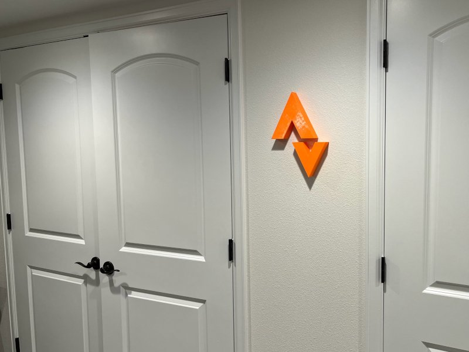
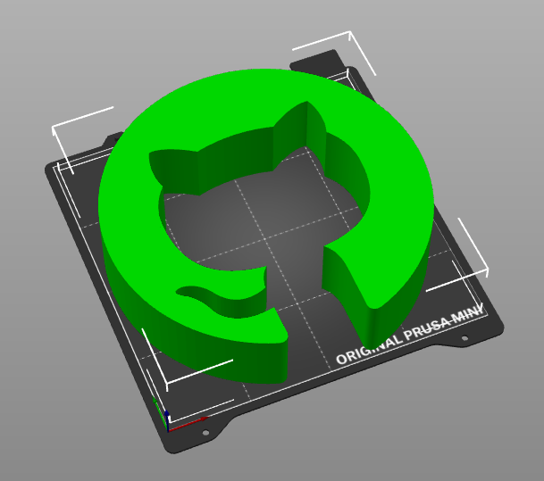

# Print **ANY** Logo in 3D

This [OpenSCAD](https://openscad.org/) file can be used to print **any** logo in
3D. This makes great wall art!

I've included the GitHub logo as a sample. The copyright for the GitHub logo
belongs to GitHub, but this usage is allowed by their [logo usage
guidelines](https://github.com/logos).

## Customization Instructions

1. Download an SVG of the logo you want to use.
[github-mark.svg](github-mark.svg) is an example SVG of the GitHub logo.
2. Edit the [3D-Logo.scad](3D-Logo.scad) file to replace the `github-mark.svg`
filename with the filename of the logo you want to use.
3. Adjust the `svg_size` parameter to match the maximum width or height of your
SVG logo (which you can typically find by opening the SVG file in a text
editor).
4. Adjust the hanger hole center position as needed for your logo.
5. Adjust the output height and thickness as desired.
6. Use [OpenSCAD](https://openscad.org/) to produce an STL file.

## Printer Settings

- Most logos should print well in PLA or PETG.
- As little as 5% infill should work.
- No supports needed.
- Print without a skirt on a small print beds (Prusa MINI).

## Alternative Approach

**Can't find an SVG with a good path?**

If you're finding it difficult to work with an SVG, you can create the path
manually. This works very well for geometric logos but can work for any logo if
you use enough points.

1. Import the logo into an image editor like the [GIMP](https://www.gimp.org/).
2. Adjust the canvas size to 100x100. (Avoid distorting the logo while scaling
it. You might need a combination of the scale tool and the resize canvas tool.)
3. Use the measurement tools from your image editor to manually create a list of
points for the perimeter of the shape you want.
4. Save the path into the OpenSCAD file from the
[manual-path](https://github.com/mkasberg/3d-logo/tree/manual-path) branch.

----

GitHub Logo SVG obtained from <https://github.com/logos>. The copyright for the
logo belongs to GitHub. See [GitHub logo usage
guidelines](https://github.com/logos).

